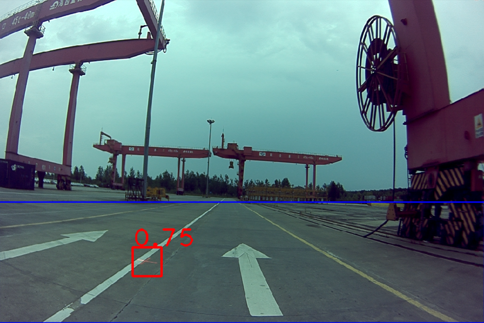

## 使用说明
本例子主要使用一个十字叉丝的掩模作为模板，然后使用HSV颜色空间的H通道作为图像的主成分，使用一个2D卷积的操作探测图像中与模板十字叉丝最为接近的区域。

### 基于ROS的C++检测代码

#### 编译
`cd catkin_ws`  
`catkin_make`  

#### 运行
`source devel/setup.bash`  
`roslaunch cross_detection cross_detection.launch`  

#### 参数
|参数|说明|
|:--:|:--:|
|image_raw_topic|侦听的原始的图像的会话名称|
|if_render_results|设置为1，则会输出渲染图像，设置为0，则不输出渲染图像|
|image_render_topic|如果输出渲染图像，则为渲染图像会话的名称|
|cross_template_file|十字叉丝模板文件的位置|
|h_threshold|H通道的阈值|
|crop_x1|兴趣区左上角X坐标|
|crop_y1|兴趣区左上角Y坐标|
|crop_x2|兴趣区右下角X坐标|
|crop_y2|兴趣区右下角Y坐标|
|score_threshold|输出BBOX的置信度阈值|
|boundingBoxesTopic|BBOX的会话名称|

#### 如果你的十字叉丝在摄像头区域的形状发生变化，需要重新生成十字叉丝模板怎么办？
如果需要重新生成十字叉丝，你需要得到一张比较不错的存在十字叉丝的图片，然后使用本工程中`matlab/select_cross_template.m`脚本辅助你生成模板，唯一需要你做的就是鼠标点击样本中十字叉丝的中心。

#### 消息输出的类型
消息目前是以ROS的消息输出的，消息类型单独为一个工程，是一个和深度学习目标探测输出一样的结果（该工程可能升级为一个基于深度学习样本进行十字叉丝的工程，因此输出结果考虑了兼容性）。具体的消息类型可以参考`bboxes_ros_msgs`

#### 一个直观的检测结果
其中蓝色框是我们设置的ROI区域，红色是检测到的十字叉丝（目前十字叉丝没有做尺度不变性，所以近处的十字叉丝因为比模板要大，因此虽然目视比较显著，但是得分往往比较低）

  
